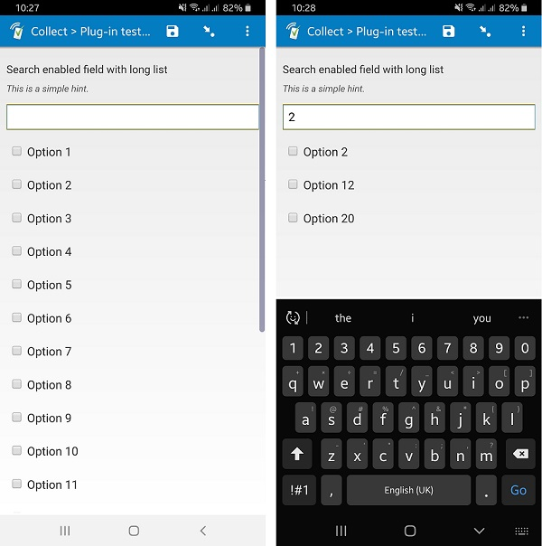

# Search select multiple

## Description

This field plug-in adds the ability to filter choice list options for a *select_mutiple field.* Filter by entering search text into the search field. Also see the sibling field plug-in, [search-select_one](https://github.com/surveycto/search-select-one/blob/master/README.md).

## Default SurveyCTO feature support

| Feature / Property | Support |
| --- | --- |
| Supported field type(s) | `select_multiple`|
| Default values | Yes |
| Custom constraint message | Yes |
| Custom required message | Yes |
| Read only | Yes |
| media:image | Yes |
| media:audio | Yes |
| media:video | Yes |
| `minimal` appearance | No |
| `compact` appearance | No |
| `compact-#` appearance | No |

This field plugin started with the [baseline-select_multiple field plug-in](https://github.com/surveycto/baseline-select_multiple) as a template and inherits the listed [expanded features](https://github.com/surveycto/baseline-select_multiple#expanded-feature-support) supported by the baseline field plugin.

## How to use

1. Download the test form [extras/sample-form](https://github.com/surveycto/search-select-multiple/raw/master/extras/sample-form/Sample%20Form%20-%20Search%20a%20select_multiple%20choice%20list.xlsx) from this repo and upload it to your SurveyCTO server.
1. Download the [search-select-multiple.fieldplugin.zip](https://github.com/surveycto/search-select-multiple/raw/master/search-select-multiple.fieldplugin.zip) file from this repo, and attach it to the test form on your SurveyCTO server.

## More resources

* **Test form**  
You can find a sample form definition here: 
[Download sample form](https://github.com/surveycto/search-select-multiple/raw/master/extras/sample-form/Sample%20Form%20-%20Search%20a%20select_multiple%20choice%20list.xlsx)

* **Developer documentation**  
Instructions and resources for developing your own field plug-ins.  
[https://github.com/surveycto/Field-plug-in-resources](https://github.com/surveycto/Field-plug-in-resources)

* **User documentation**  
How to get started using field plug-ins in your SurveyCTO form.  
[https://docs.surveycto.com/02-designing-forms/03-advanced-topics/06.using-field-plug-ins.html](https://docs.surveycto.com/02-designing-forms/03-advanced-topics/06.using-field-plug-ins.html)
